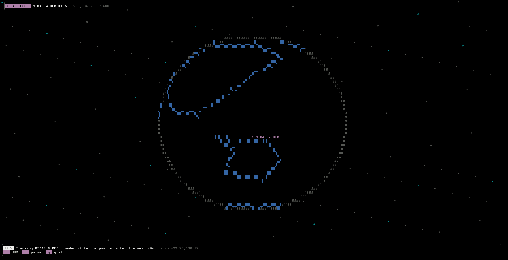
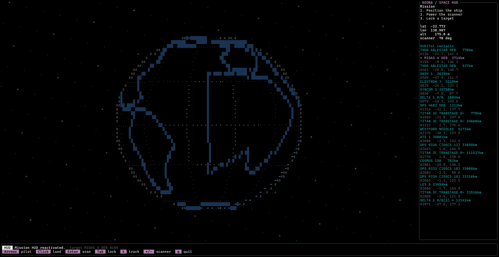
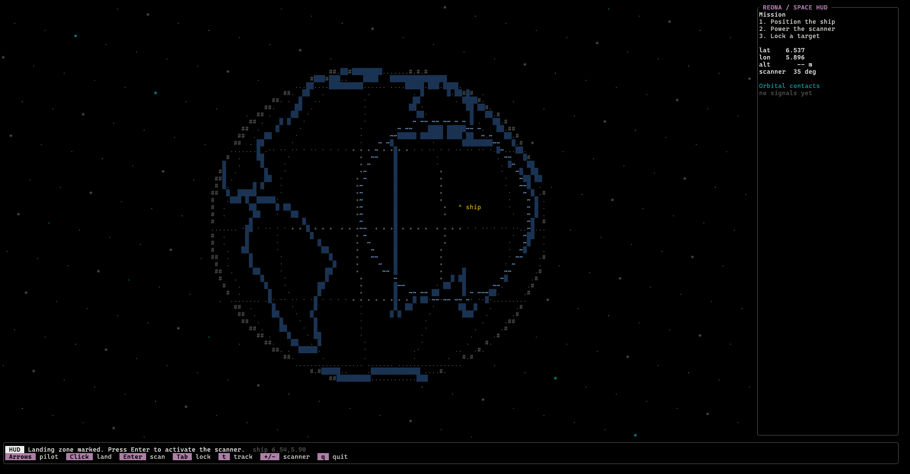

# Reona


Reona is a terminal-based satellite mission HUD built with Rust, Ratatui, and Crossterm. It lets you pick an observer position on a rotating globe, scan nearby orbital contacts through N2YO, and track a selected satellite with a target-following orbital view.

## Features

- Interactive terminal UI with keyboard and mouse support.
- Space-themed globe, starfield, scanner radius, and orbital contact list.
- Nearby satellite discovery through direct N2YO API calls.
- Satellite tracking mode that requests 40 future positions, moves the satellite along that feed, and refreshes the tracking window before it expires.
- Configurable N2YO/Open-Meteo URLs, timeouts, search radius, and satellite category.

## Screenshots







## Requirements

- Rust stable with edition 2024 support.
- An N2YO API key.
- A terminal that supports alternate screen rendering.

## Quick Start

Set your N2YO API key, then run Reona:

```bash
N2YO_API_KEY=change-me cargo run
```

Reona resolves observer elevation through Open-Meteo and calls N2YO directly. It does not start or require a local API server.

If you downloaded a release binary, make it executable and run it directly:

```bash
chmod +x ./reona-x86_64-unknown-linux-gnu
N2YO_API_KEY=change-me ./reona-x86_64-unknown-linux-gnu
```

Release packages are currently Linux-only.

## Configuration

Reona reads configuration from environment variables. A `.env` file is also supported.

| Variable | Default | Description |
| --- | --- | --- |
| `N2YO_API_KEY` | required | N2YO REST API key. |
| `N2YO_BASE_URL` | `https://api.n2yo.com/rest/v1/satellite` | N2YO satellite API base URL. |
| `N2YO_TIMEOUT_SECONDS` | `10` | N2YO request timeout in seconds. |
| `OPEN_METEO_ELEVATION_URL` | `https://api.open-meteo.com/v1/elevation` | Open-Meteo elevation API URL. |
| `OPEN_METEO_TIMEOUT_SECONDS` | `10` | Open-Meteo request timeout in seconds. |
| `REONA_DEFAULT_SEARCH_RADIUS` | `70` | Initial scan radius in degrees, from `0` to `90`. |
| `REONA_DEFAULT_CATEGORY_ID` | `0` | Satellite category ID passed to the upstream API. |

Example:

```bash
N2YO_API_KEY=change-me REONA_DEFAULT_SEARCH_RADIUS=45 cargo run
```

## Controls

| Key / Input | Action |
| --- | --- |
| `Arrow keys` | Move the observer ship on the globe. |
| `Mouse click` | Pick a landing/observer position on the globe. |
| `Enter` | Scan for orbital contacts. |
| `Tab` | Select the next detected satellite. |
| `t` | Toggle satellite tracking mode. |
| `r` | Refresh the current scan or tracking feed. |
| `+` / `-` | Increase or decrease scanner radius. |
| `c` | Clear current results and choose another zone. |
| `q` / `Esc` | Quit. |

## Tracking Behavior

When tracking starts, Reona requests the next 40 seconds of positions for the selected satellite from N2YO:

```text
positions/{satid}/{lat}/{lon}/{alt}/{seconds}/
```

The globe follows the target longitude during tracking so the selected satellite stays visible. Reona interpolates the current satellite position from the returned timestamps, draws the future path, and refreshes the next 40-second window 5 seconds before the current feed expires.

## Development

Format the code:

```bash
cargo fmt
```

Run linting:

```bash
cargo clippy --all-targets --all-features -- -D warnings
```

Run tests:

```bash
cargo test --all-features
```

Build locally:

```bash
cargo build
```

Build an optimized binary:

```bash
cargo build --release
```

## Releases

GitHub Actions builds and uploads the Linux executable directly as `reona-x86_64-unknown-linux-gnu` when a GitHub release is created. `N2YO_API_KEY` must still be provided in the runtime environment or `.env` file.
